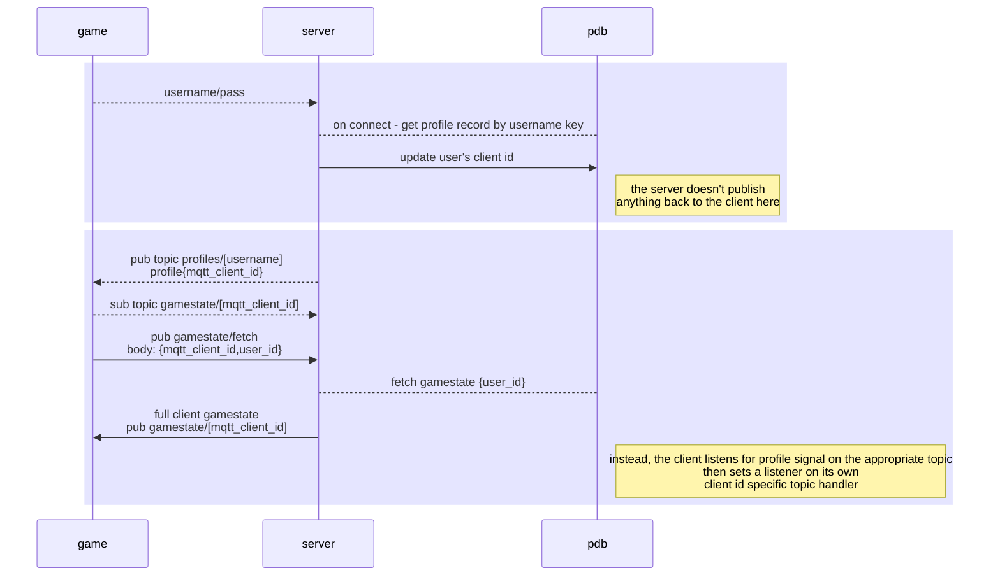
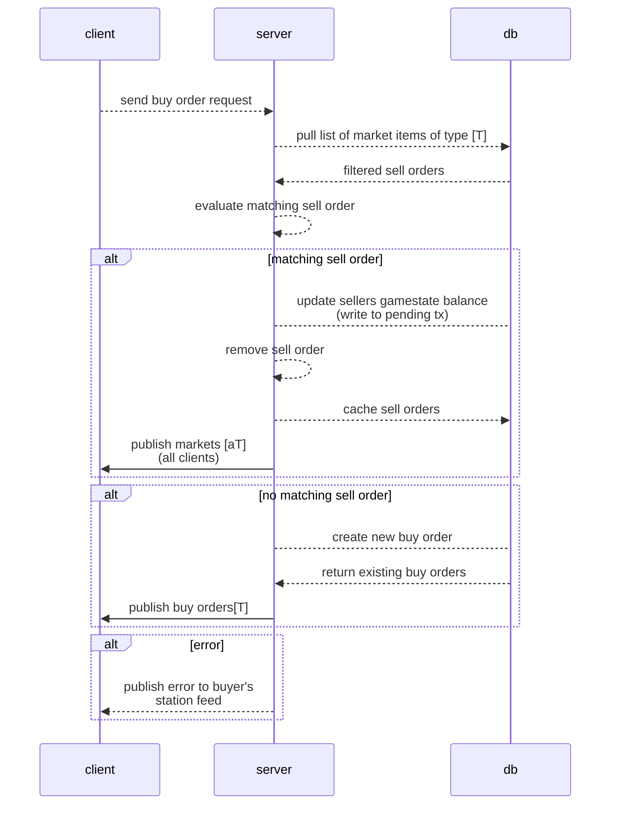

# auth

authentication consists of taking in a username/password and generating a 

```mermaid
sequenceDiagram
rect rgba(0, 0, 255, .1)
participant game
participant server
participant pdb
game -->> server: username/pass
server --> pdb: on connect - get profile record by username key
server ->> pdb: update user's client id
note right of pdb: the server doesn't publish<br>anything back to the client here
end
rect rgba(0, 0, 255, .1)
server -->> game: pub topic profiles/[username]<br>profile{mqtt_client_id}
game -->> server: sub topic gamestate/[mqtt_client_id]
game ->> server: pub gamestate/fetch <br>body: {mqtt_client_id,user_id}
server --> pdb: fetch gamestate {user_id}
server ->> game: full client gamestate<br>pub gamestate/[mqtt_client_id]
note right of pdb: instead, the client listens for profile signal on the appropriate topic<br>then sets a listener on its own<br>client id specific topic handler
end
```

## markets buy order flow

```mermaid
sequenceDiagram
    rect rgba(255, 255, 255, 0.1)
    participant client
    participant server
    participant db
    client -->> server: send buy order request
    server -->> db: pull list of market items of type [T]
    db -->> server: filtered sell orders
    server -->> server: evaluate matching sell order
    alt matching sell order
        server --> db: update sellers gamestate balance<br> (write to pending tx)
        server -->> server: remove sell order
        server -->> db: cache sell orders
        server ->> client: publish markets [aT]<br>(all clients)
    end
    alt no matching sell order
        server --> db: create new buy order
        db -->> server: return existing buy orders
        server ->> client: publish buy orders[T]
    end
    alt error
        server -->> client: publish error to buyer's<br>station feed
    end
end
```